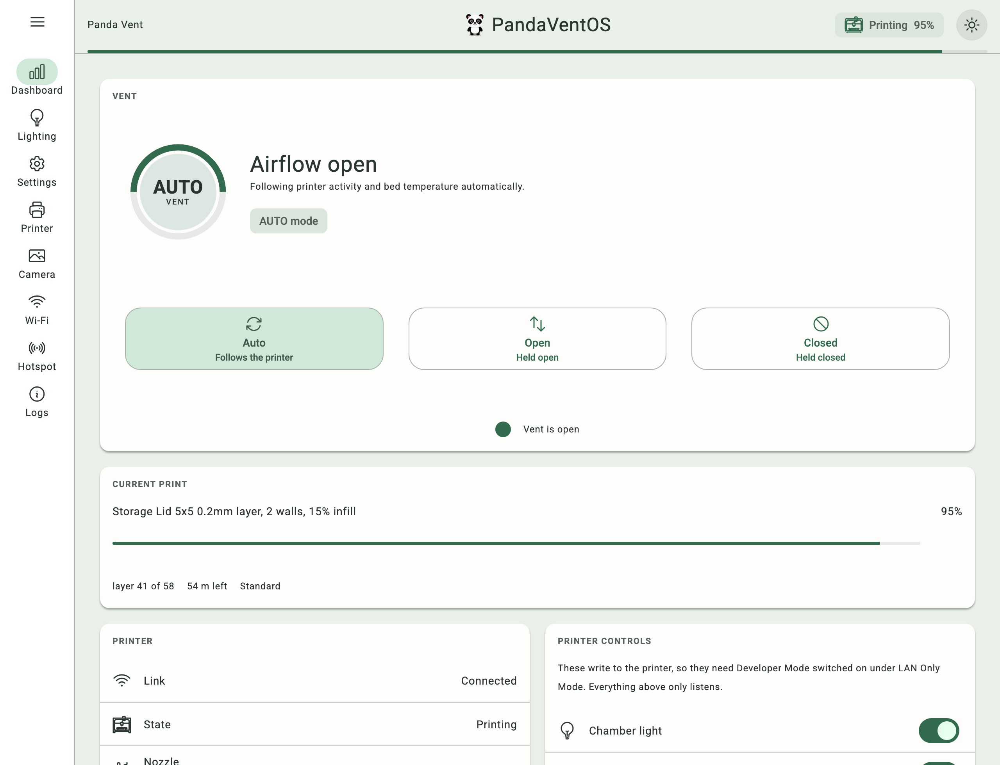
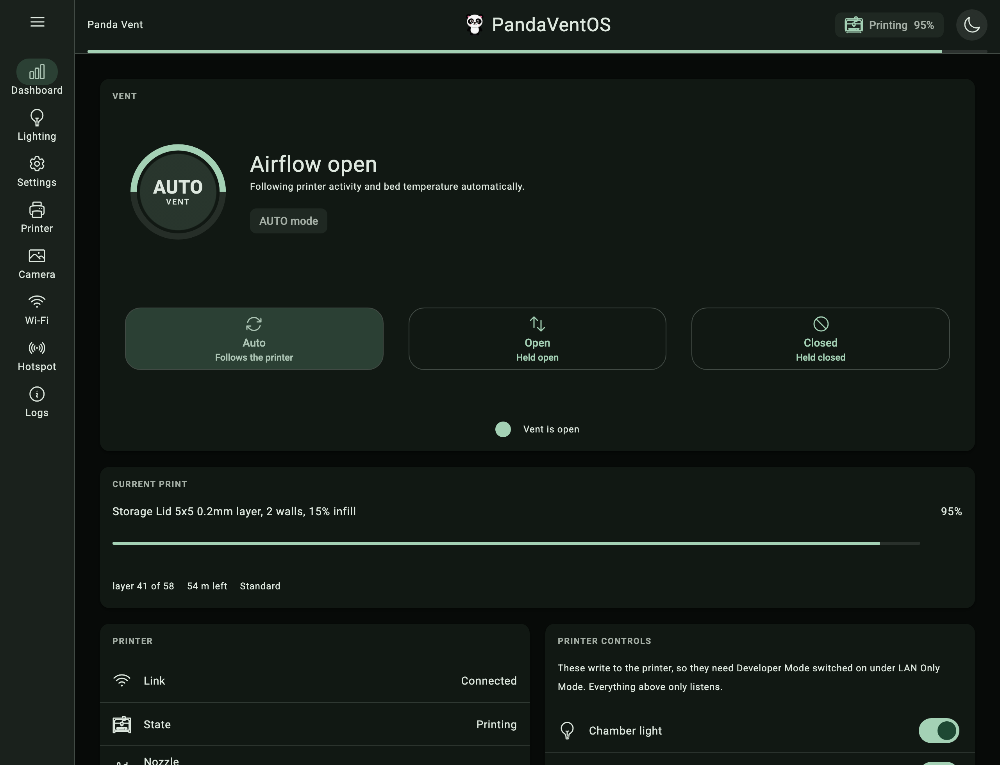
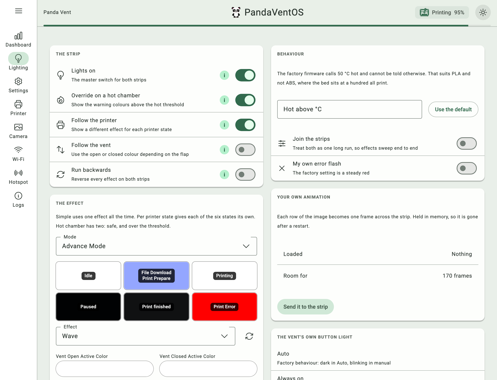
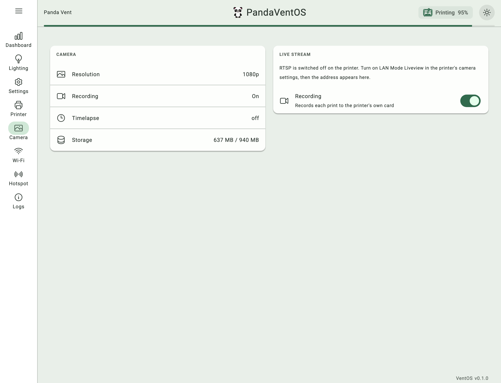
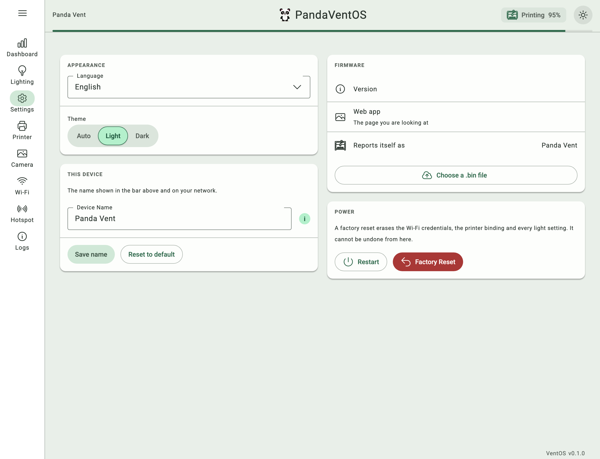
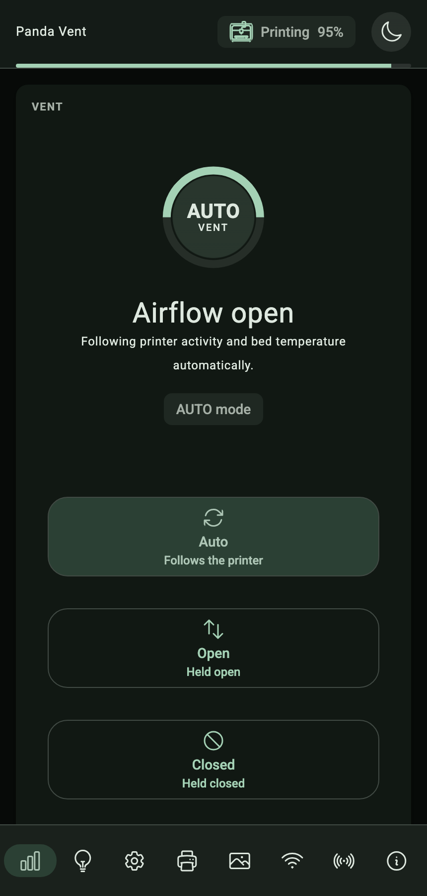

<p align="center">
    <picture>
        <source media="(prefers-color-scheme: dark)" srcset="screenshots/banner-dark.svg">
        <source media="(prefers-color-scheme: light)" srcset="screenshots/banner-light.svg">
        
    </picture>
</p>

<p align="center">
Open source firmware for the BIQU Panda Vent for Bambu P2S that has all the original features<br>
plus many more to truly customize your vent system. 24 languages supported.
</p>

<p align="center">
<sub>PandaVentOS is not affiliated with, endorsed by, or supported by BIQU or BIGTREETECH.<br>
It is a reimplementation, not a modification of their firmware. "Panda Vent" is used only to name the hardware it runs on.</sub>
</p>

<p align="center">
    <a href="https://github.com/jeremykenedy/PandaVentOS/actions/workflows/ci.yml"></a>
    <a href="https://github.com/jeremykenedy/PandaVentOS/releases"></a>
    <a href="LICENSE.md"></a>
    <a href="#requirements"></a>
    <a href="#requirements"></a>
    <a href="#languages"></a>
</p>

## Table of Contents

- [What Makes It Different](#what-makes-it-different)
- [Features](#features)
  - [Lighting](#lighting)
  - [Venting](#venting)
  - [Printer](#printer)
  - [Device](#device)
- [Languages](#languages)
- [Screenshots](#screenshots)
- [What It Does Not Do](#what-it-does-not-do)
- [Requirements](#requirements)
- [Installation](#installation)
  - [Back Up First](#back-up-first)
  - [First Install, By Hand](#first-install-by-hand)
  - [Updating, Over The Network](#updating-over-the-network)
  - [Going Back](#going-back)
- [First Time Setup](#first-time-setup)
- [Settings Migration](#settings-migration)
- [Documentation](#documentation)
- [Project Layout](#project-layout)
- [Testing](#testing)
- [License](#license)

## What Makes It Different

PandaVentOS reimplements what the factory application does, from its observed
behaviour, and then goes past it. It is not a modified copy of BIQU's firmware
and shares no code with it. The stock partition layout is untouched, so one
upload puts the factory firmware back whenever you want it.

| | Factory v1.0.0 | PandaVentOS |
| --- | :---: | :---: |
| **Lighting effects** | 7 | **22** |
| **Colours per effect** | 1 | **4** |
| **Vent aware colour** | :x: | :white_check_mark: separate open and closed colour |
| **Unlit pixel colour** | always black | :white_check_mark: settable, per effect |
| **Per strip LED count** | fixed at 16 | :white_check_mark: set each strip |
| **Strip direction** | forward only | :white_check_mark: 3 reverse modes |
| **Custom animation upload** | :x: | :white_check_mark: |
| **Brightness ramp** | :x: fixed brightness | :white_check_mark: ramps over each cycle |
| **Two runs as one strip** | :x: each renders separately | :white_check_mark: contiguous mode |
| **Fault colour** | red at 127, fixed | :white_check_mark: any colour, brightness, solid or strobe |
| **Warning temperature** | 50 °C, compiled in | :white_check_mark: yours |
| **Warning gradient range** | compiled in | :white_check_mark: both ends settable |
| **Vent modes** | Open, Closed, Auto | Open, Closed, Auto |
| **AUTO rule** | open while printing or paused | :white_check_mark: plus per material rules |
| **Reads the AMS** | :x: | :white_check_mark: 9 materials, each switchable |
| **Residual heat hold** | :x: | :white_check_mark: bed temperature hysteresis |
| **Live flap position** | :x: target only | :white_check_mark: target, actual and travelling |
| **Endstop recalibration** | button only | :white_check_mark: from the web page |
| **Vent button ring light** | 1 behaviour | :white_check_mark: 5 modes |
| **Printer light control** | :x: | :white_check_mark: chamber and toolhead |
| **Printer telemetry** | connection only | :white_check_mark: 19 readings |
| **AMS readout** | :x: | :white_check_mark: humidity, temperature, every spool |
| **Fault codes** | :x: | :white_check_mark: decoded, in Bambu's own spelling |
| **Languages** | 2 | **24**, Arabic RTL |
| **Device name** | fixed | :white_check_mark: yours |
| **Full flash backup** | USB cable only | :white_check_mark: `GET /backup`, about 17 seconds |
| **Plain restart** | power cycle | :white_check_mark: from the web page |
| **Failed save reporting** | silent | :white_check_mark: reported and shown |
| **Settings across updates** | :x: | :white_check_mark: migrated field by field |
| **Web UI** | BIQU stock | Material 3 tokens, generated from one seed |
| **Dark mode** | :x: one look | :white_check_mark: Auto, Light or Dark |
| **Typeface** | Arial | :white_check_mark: Roboto, embedded, 5 scripts |
| **Icons** | raster PNGs | :white_check_mark: one stroked sprite, tints with the text |
| **Navigation** | bottom bar | :white_check_mark: bottom bar, or a left rail that expands |
| **Contrast** | unchecked | :white_check_mark: every pair measured, plain and through 3 CVD simulations |
| **Partition layout** | stock | :white_check_mark: identical |
| **Source published** | :x: | :white_check_mark: MIT |

## Features

### Lighting

| Setting | What it does |
| --- | --- |
| **Stock effects, unchanged ids** | Static, Breathing, Strobing, Wave, Marquee, Color Cycle, Rainbow |
| **Added effects** | Cylon, Bounce, Progress Bar, Marquee Out, Marquee In, Fill Out, Fill In, Bounce Out, Bounce In, Bounce Fill Out, Bounce Fill In, Animated Progress, Barber Pole, Bed Temperature, Animation |
| **Progress Bar** | driven by the printer's own `mc_percent`, not a timer |
| **Four colours per effect** | active and inactive, for vent open and vent closed, with sync buttons |
| **Inactive colour** | optional; unset renders bit identical to the stock renderer |
| **Per strip length** | each of the two strips has its own count, one shared animation phase |
| **Direction** | forward or reversed: a device flip, a per strip flip, and a per effect flip, combined |
| **Temperature warning** | stock Mode 3 preserved |
| **H2D advanced mode** | stock Mode 2 preserved, six state blobs |
| **Custom animation** | upload frames and play them from RAM |
| **Brightness ramp** | optional; ramps from a start to an end brightness over each cycle |
| **Contiguous** | treat the two runs as one strip so the light travels the whole length once |
| **Fault colour** | any colour, any brightness, solid or strobing, instead of stock's fixed red |

### Venting

| Setting | What it does |
| --- | --- |
| **Manual** | Open and Closed from the page or the button |
| **Auto** | the factory rule: open while printing or paused |
| **Material aware** | optional layer on top of Auto, on by default; switching it off restores stock exactly |
| **Vents** | PLA, PETG, PET, TPU |
| **Seals** | ABS, ASA, PC, PA, HIPS |
| **Unmatched filament** | falls back to the stock answer, never guesses |
| **Residual heat hold** | holds open until the bed cools, 45 °C open and 35 °C close, both editable |
| **Live dial** | shows where the flap actually is, and spins while it travels |
| **Endstop** | recalibrate from the page |
| **Ring light** | factory behaviour, always on, always off, on while open, off while closed |

### Printer

| Setting | What it does |
| --- | --- |
| **Link** | Bambu LAN MQTT over TLS, scan and bind or enter by hand |
| **Reads** | state, progress, layer, ETA, nozzle, bed and chamber temperature, the fitted nozzle, filament runout, door, fan speeds, speed level, lights, Wi-Fi signal, AMS humidity and temperature, every spool with its colour and remaining, HMS fault codes, waiting firmware updates |
| **Controls** | the chamber light and the toolhead light |
| **Does not control** | fans, print speed, temperatures. See below |

**Why the fans and the speed are not there.** They were, they worked, and the
printer threw every one of them away. Measured on real hardware, one command at
a time, on one connection: `ledctrl` comes back `result: success` and every
`gcode_line` and `print_speed` comes back `mqtt message verify failed`.

The printer says so itself, in the `fun` field of its own report: bit
`0x20000000` means unsigned commands are rejected. That needs **Developer
Mode**, which is a separate switch underneath LAN Only Mode in the printer's
network settings and only appears once LAN Only Mode is on and the printer has
restarted.

A control that cannot work is worse than no control, so the ones that cannot
are not offered. If your printer is in Developer Mode the firmware still speaks
every one of those commands; only the web page stopped drawing them.

### Device

| Setting | What it does |
| --- | --- |
| **Name** | set your own, used for mDNS and the page title |
| **Wi-Fi** | STA, plus the setup hotspot |
| **Backup** | `GET /backup` streams the whole 4 MB image over the network |
| **Restart** | plain restart, and factory reset |
| **OTA** | one upload, no cable, settings carried forward |
| **Save failures** | reported in the state document and shown on the page |
| **Logs** | live device log, on its own page |
| **Camera** | what the printer's camera is doing, its RTSP address, and its recording switch |

## Languages

Twenty four, every one of them at full coverage. There is no partial
translation: a language ships when all 402 strings are in it. A string that is
somehow missing falls back to English rather than showing a raw key.

| Language | Native name | Code | |
| --- | --- | :---: | --- |
| English | English | `en` |  |
| Chinese (Simplified) | 简体中文 | `zh` |  |
| Spanish | Español | `es` |  |
| French | Français | `fr` |  |
| German | Deutsch | `de` |  |
| Italian | Italiano | `it` |  |
| Portuguese | Português | `pt` |  |
| Dutch | Nederlands | `nl` |  |
| Polish | Polski | `pl` |  |
| Indonesian | Bahasa Indonesia | `id` |  |
| Filipino | Filipino | `fil` |  |
| Vietnamese | Tiếng Việt | `vi` |  |
| Japanese | 日本語 | `ja` |  |
| Korean | 한국어 | `ko` |  |
| Cantonese | 粵語 | `yue` |  |
| Russian | Русский | `ru` |  |
| Ukrainian | Українська | `uk` |  |
| Serbian | Српски | `sr` |  |
| Greek | Ελληνικά | `el` |  |
| Arabic | العربية | `ar` | right to left |
| Thai | ไทย | `th` |  |
| Hindi | हिन्दी | `hi` |  |
| Bengali | বাংলা | `bn` |  |
| Punjabi | ਪੰਜਾਬੀ | `pa` |  |

Arabic is right to left. The whole layout mirrors, not just the text.

Pick a language on first boot, or change it any time from the Settings page.

## Screenshots

| Dashboard, light | Dashboard, dark |
| --- | --- |
|  |  |

| Lighting | Camera |
| --- | --- |
|  |  |

| Settings | On a phone |
| --- | --- |
|  |  |

## What It Does Not Do

- **It does not control the printer beyond its lights.** Everything under the
  printer's `print` command namespace is signature checked and refused, which
  its own firmware confirms; only the chamber and work lights are accepted. So
  no print speed, no fan control, no pause or resume from here.
- **It reads the printer over the LAN only.** The printer has to be in LAN
  Only Mode and reachable on the same network. There is no cloud path.
  Reading itself is never gated: every value arrives whatever mode the printer
  is in. Developer Mode is only about what the printer will *accept*, and the
  one write that gets through without it is the lights.
- **It does not know where the flap is.** There is no position encoder. The
  hall sensor's end bands are the limit switches, the same as stock, so the
  vent knows "open" and "closed" and nothing between them.
- **It does not stop a jammed flap quickly.** A group that misses its band is
  abandoned after about eight hundred milliseconds and latches a fault; there
  is no travel timeout beyond that.
- **It is one flap, up to four motor groups, and two LED strips.** Nothing here
  scales past the hardware it was written for.
- **No warranty of any kind.** Flashing third-party firmware can void yours.
  Read `firmware/SAFETY.md` and take the full backup it asks for.

## Requirements

| Requirement | Detail |
| --- | --- |
| **Hardware** | BIQU Panda Vent, ESP32-U4WDH, 4 MB flash |
| **Toolchain** | ESP-IDF v5.3.1, target ESP32 |
| **Printer** | Bambu Lab, in LAN Only Mode |
| **USB** | CH34x serial bridge; macOS may need the vendor VCP driver |

## Installation

There is a script, and it takes a backup before it writes anything.

```bash
git clone https://github.com/jeremykenedy/PandaVentOS.git
cd PandaVentOS
tools/install.sh
```

| Step | It does |
| :---: | --- |
| 1 | finds your device on USB, or takes `--port` |
| 2 | reads the **whole 4 MB** off it and verifies the size |
| 3 | tells you where that backup is, and that it holds your Wi-Fi password |
| 4 | builds, or takes a release image with `--image` |
| 5 | asks once more, then flashes |

Any failure before step 5 leaves the device untouched. The backup is not
optional and there is no flag to skip it.

### Back Up First

If you would rather do it by hand, this is the part that matters. The whole
4 MB, offset 0 to 0x400000, including the bootloader, partition table, otadata,
both app slots and NVS. BIQU publishes only the app image, so if you lose the
bootloader there is nothing public to put back.

```bash
python3 -m esptool --chip esp32 --port <YOUR-PORT> -b 115200 \
  read-flash 0 0x400000 golden-full-4MB.bin
```

Read [`firmware/SAFETY.md`](firmware/SAFETY.md) before the first flash. It is
short, and every rule in it is there because skipping it cost somebody a
working vent.

### First Install, By Hand

```bash
cd firmware
idf.py build
idf.py -p <YOUR-PORT> flash
```

### Updating, Over The Network

Every later update is a single upload. No cable.

```bash
tools/install.sh --network <device-ip>
```

That takes a fresh backup over the network first, then uploads, then waits for
the device to come back. By hand it is:

```bash
curl -X POST -H 'OTA-Type: ota_fw' \
  --data-binary @firmware/build/pandaventos.bin \
  http://<device>/ota
```

Settings are migrated forward automatically.

### Going Back

```bash
tools/restore.sh --factory <device-ip>       # BIQU's firmware, over the network
tools/restore.sh --factory --port /dev/...   # BIQU's firmware, over a cable
tools/restore.sh --image <your-backup.bin>   # your own 4 MB image, cable only
tools/restore.sh --list                      # what backups you have
```

`--factory` puts BIQU's application image back. It does not restore your
settings: the stock firmware does not understand this one's configuration and
replaces it with its own defaults.

`--image` writes a full 4 MB image taken off your own device, which is the only
thing that recovers a device that will not boot.

## First Time Setup

| Step | What to do |
| :---: | --- |
| 1 | Power the vent. It raises a hotspot named `Panda_Vent_<MAC>`. |
| 2 | Join it and open `http://192.168.4.1`. |
| 3 | Pick a language, choose your Wi-Fi, enter its password. |
| 4 | Bind the printer: scan, pick it, enter its LAN mode access code. |
| 5 | Reach it afterwards at `http://<hostname>.local` or its IP. |

## Settings Migration

The stored configuration has changed shape several times. Every older layout is
read and lifted forward field by field, so updating never asks you to set the
device up again. `tools/cfgmig` runs a real stored blob through the real
migration so that claim can be tested rather than believed.

The configuration lives in a 12 KB NVS partition shared with the Wi-Fi stack,
and `PV_CFG_MAX_BYTES` fails the build if it grows past its budget. That check
exists because the config once outgrew the partition, saves began failing, and a
reboot lost everything. It cannot happen quietly again: a failed save is
reported in the state document and shown on the page.

## Documentation

Every setting, what it does, and why it is there.

| Document | Covers |
| --- | --- |
| [`docs/lighting.md`](docs/lighting.md) | Modes, all 22 effects, the four colours, brightness ramps, direction, strip length |
| [`docs/venting.md`](docs/venting.md) | Vent modes, the nine material rules, residual heat hold, the ring light, endstop |
| [`docs/printer.md`](docs/printer.md) | Binding, LAN Only Mode, what it reads, what it can change |
| [`docs/network.md`](docs/network.md) | Wi-Fi, mDNS, the setup hotspot, what it talks to |
| [`docs/backup.md`](docs/backup.md) | Full image, settings snapshot, restore, going back to stock |
| [`docs/troubleshooting.md`](docs/troubleshooting.md) | It does not do the thing. Start here |
| [`firmware/SAFETY.md`](firmware/SAFETY.md) | What will brick the device, and what will not |

## Project Layout

| Path | What it is |
| --- | --- |
| `firmware/` | the ESP-IDF application |
| `tools/` | `install.sh`, `restore.sh`, and the host harnesses: effect renderer, config migration runner, UI comparison |
| `docs/` | what every setting actually does |
| `screenshots/` | images used by this page |
| `private/` | gitignored; where device specific backups and snapshots go |

## Testing

| Harness | What it does |
| --- | --- |
| `tools/fxdump` | compiles the real `pv_rgb.c` and prints frames as ASCII |
| `tools/cfgmig` | runs a real stored NVS blob through the real migration |
| `tools/uicmp` | compares the served page against the factory page |

## License

Released under the [MIT license](https://opensource.org/licenses/MIT). The full
text is in [`LICENSE.md`](LICENSE.md).

### Third-party components

The page itself carries the notices for everything compiled into it, in a
comment at the top of the served HTML, so the attribution reaches anyone
holding a flashed device and not only anyone holding this repository.

| component | what it is | licence, and where the text is |
| --- | --- | --- |
| iro.js 5.5.2 | the colour wheel | [MPL-2.0](https://www.mozilla.org/en-US/MPL/2.0/) -- `firmware/main/vendor/iro/LICENSE.txt` |
| Beer CSS 5.0.3 | the stylesheet and its script | [MIT](https://opensource.org/licenses/MIT) -- `firmware/main/vendor/beercss/LICENSE.txt` |
| Heroicons | the interface icons in the sprite | [MIT](https://opensource.org/licenses/MIT) -- `firmware/main/vendor/heroicons/LICENSE.txt` |
| Roboto 3.015 | the embedded typeface, 5 subsets | **[SIL OFL 1.1](https://openfontlicense.org)** -- `firmware/main/vendor/roboto/OFL.txt` |
| ESP-IDF | build dependency, not vendored | Apache 2.0 |

Only iro.js is stored as a file. The other three are spliced into `ui.html` by
the page build, because the device serves one file and a second copy on disk
would be a second copy to keep in step. Each still has its own directory under
`firmware/main/vendor/` holding the licence text and a note on what was taken.

**The typeface is not under this repository's licence.** Roboto 3 is OFL-1.1,
which is a different set of obligations from the MIT terms covering everything
else here. If you reuse the font, read `vendor/roboto/OFL.txt` first.

### Not affiliated with BIQU or BIGTREETECH

Independent firmware for the BIQU Panda Vent. Not affiliated with, endorsed by,
or supported by Shenzhen BIGTREE Technology Co., Ltd., BIQU or BIGTREETECH, and
a reimplementation rather than a modification of their firmware. "Panda Vent"
is their product name, used here only to identify the hardware this runs on.
Bambu Lab, AMS and P2S are Bambu Lab's.
